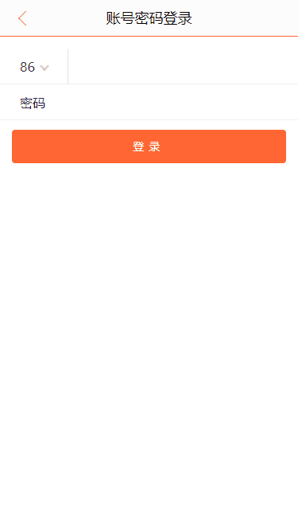

# 大众点评Web App

## 项目介绍

本项目使用React+Redux开发大众店铺Web App。项目主要包括首页相关商品展示、商品详情页、搜索页、搜索结果页、登陆页等。

## 如何运行

+ 克隆代码：`https://github.com/ReactToLRH/react-dianping.git`
+ 安装依赖：`npm install`
+ 运行：`npm run start`
+ 打包：`npm run build`

## 基础知识

+ [Redux模块](./readme/redux.md)

## 使用模块

+ [react-slick](https://react-slick.neostack.com/): React轮播组件(react-slick样式库：`slick-carousel`)
+ [Reselect](https://github.com/reduxjs/reselect): 可以创建可记忆的(Memoized)、可组合的 selector 函数。Reselect selectors 可以用来高效地计算 Redux store 里的衍生数据。

## 目录结构

``` txt
src
 | --- components                公共组件
 | --- containers                容器型组件
 | --- images                    图片
 | --- redux                     全局状态管理
 |       | --- middleware        中间件
 |       | --- modules           状态管理模块
 |       |        | --- entities 领域模块管理
 |       |        | --- app.js   通用前端基础状态模块
 |       | --- store.js          store
 | --- utils 工具类
```

## 项目展示



