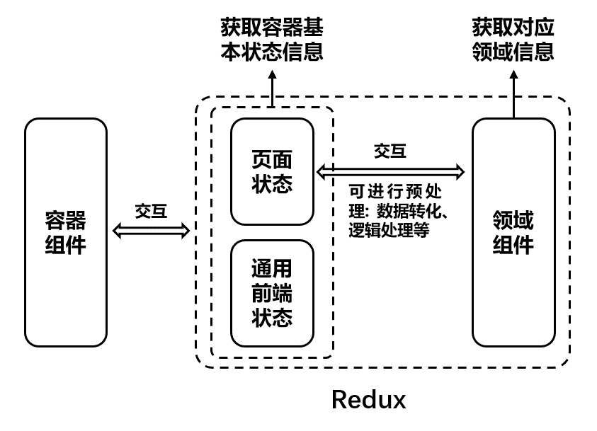

# Redux

## 状态模块定义(以本项目为例)

+ 领域实体类：商品(`src/redux/entities/products.js`)、店铺(`src/redux/entities/shops.js`)、订单(`src/redux/entities/orders.js`)、评论(`src/redux/entities/comments.js`)
+ 各页面UI状态
+ 前端基础状态：登录态、全局异常信息

## Redux模块分层

状态管理层分为两层：

+ 页面状态 和 通用前端基础状态
+ 领域状态
  

容器组件可以通过 `页面状态、通用前端基础状态` 获取容器状态所需要的基础信息，页面状态可以通过 `领域转态` 获取对应的领域信息，容器组件只需要通过 `页面状态、通用前端基础状态` 进行交互。

容器组件如果需要获取 `领域状态` ，只需要由 `页面转态` 获取到 `领域状态`，`领域状态` 可以在各个页面状态中进行复用，在调用的时候可以进行预处理，比如数据转化，逻辑处理

## Redux中间件

中间件的使用，本身是用来增强 `store dispatch` 的能力

`Function: ({ getState, dispatch }) => next => action`

+ 最外层函数的`dispatch` 和 `next`都可以发送`action`
+ 最外层函数的`dispatch`：加持了所有中间件的能力的dispatch方法，可以理解为最终增强的dispatch方法，发送的`action`都会经过中间层中每一个中间件的处理。
  示例：如果在`中间件mid2`中`dispatch(action)`,会经过`中间件mid1`、`中间件mid2`、`中间件mid(n)`的处理。
+ `next`：传递`action`。使用`next`传递的`action`，只会经过`中间件mid2`、`中间件mid(n)`的处理。

### Redux中间件进行网络层封装: [api.js](../src/redux/middleware/api.js)

一般情况下，每个API请求都需要dispatch至少三种action：

+ 通知reducer `请求开始` 的action
+ 通知reducer `请求成功` 的action
+ 通知reducer `请求失败` 的action
